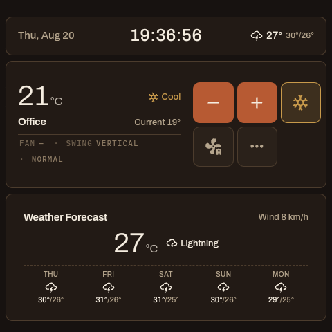

# Faceplate Cards

A suite of Home Assistant dashboard cards styled like the faceplate of a
physical appliance: an inset "LCD" readout with round tactile buttons beneath
it.

Every card is tuned for small screen real estate. A wall panel — the 86mm
Sonoff NSPanel Pro is 480×480 — gives a dashboard no room to spare, so these are built
to be compact without becoming fiddly: a whole dashboard fits on one screen
without scrolling, and every control stays big enough to hit with a thumb.
Where something has to give, the readouts shed detail before the controls
shrink, and anything needing more room takes over the screen rather than
squeezing into a tile.

One design language runs throughout: a recessed panel carrying the numbers, a
dashed rule under a row of secondary readouts, and circular controls that hold
their size as the tile gets smaller.


Every screenshot here is a photograph of the running suite, captured off a
panel over adb at its native 480×480 — not a mock, and not a desktop browser
shrunk down.

<p align="center">
  
  
</p>

Left: `faceplate-climate-card` with `faceplate-weather-card` beneath it. Right:
the same climate card over a `faceplate-buttons-card` — one card owning the
full width, because seven fan speeds laid out as separate cards cannot sit on
one line in a twelve-column grid.

## The cards

| Card | Replaces | What it does |
| --- | --- | --- |
| `custom:faceplate-climate-card` | `thermostat`, `mushroom-climate-card` | Air-conditioner remote: setpoint, mode, fan and swing, presets |
| `custom:faceplate-button-card` | `button` | One round button that fills its tile — toggles, scripts, scenes, navigation |
| `custom:faceplate-tile-card` | `tile` | Entity row: tactile icon button, name and state |
| `custom:faceplate-light-card` | `mushroom-light-card` | Light control with recessed brightness and warmth sliders |
| `custom:faceplate-clock-card` | `clock` | Time and date in LCD figures |
| `custom:faceplate-weather-card` | `weather-forecast` | Current conditions and a forecast strip |
| `custom:faceplate-banner-card` | `markdown` | Template-driven status line |
| `custom:faceplate-media-card` | `media-control`, `tile` with media features | Now playing, volume and transport controls |

Every card has a visual editor and appears in the card picker under its
Faceplate name.

## Installation

### Manual

1. Copy `dist/faceplate-cards.js` to `/config/www/faceplate-cards.js`
2. Add a dashboard resource: *Settings → Dashboards → ⋮ → Resources →*
   `/local/faceplate-cards.js` as a **JavaScript module**

One resource registers all seven cards.

### HACS (custom repository)

1. HACS → three-dot menu → *Custom repositories*
2. Add `https://github.com/bl0ckstat/faceplate-cards` with type **Dashboard**
3. Install *Faceplate Cards* — HACS registers the resource for you

Not submitted to the HACS default store.

## Configuration

Options common to the interactive cards: `entity`, `name`, `icon`,
`tap_action`, `hold_action`, `double_tap_action`. Actions take Home
Assistant's own shapes, including both `perform-action` and the older
`call-service` spelling.

### Climate

An air-conditioner remote: setpoint, mode, fan and swing, with presets and any
extra entities behind a single full-screen configuration sheet. `layout: row`
reduces it to one line for a dashboard that has to fit several.

| Option | Type | Default | Description |
| --- | --- | --- | --- |
| `entity` | string | **required** | A `climate` entity |
| `layout` | string | `standard` | `row`, `compact`, `standard` or `large`. `row` puts the readout and buttons on a single line |
| `current_temperature_entity` | string | — | Read room temperature from this sensor instead of the climate entity |
| `outdoor_temperature_entity` | string | — | Show an outdoor temperature on the display |
| `default_mode` | string | — | Mode a short press of the power button turns the unit on to |
| `hvac_modes` | list | all | Only offer these HVAC modes |
| `vertical_swing_entity` | string | — | `select` entity to use instead of the climate `swing_mode` |
| `horizontal_swing_entity` | string | — | `select` entity to use instead of `swing_horizontal_mode` |
| `setting_entities` | list | — | Extra entities in the settings popup |
| `show_controls` | boolean | `true` | `false` gives a status-only card with a much larger readout |
| `show_name`, `show_current_temperature`, `show_fan`, `show_vertical_swing`, `show_horizontal_swing`, `show_settings` | boolean | `true` | Feature toggles; controls also hide themselves when the entity can't do them |
| `step` | number | entity step | Target temperature step per press |

### Button

| Option | Type | Default | Description |
| --- | --- | --- | --- |
| `entity` | string | — | Optional: a button that only navigates needs none |
| `show_name`, `show_icon` | boolean | `true` | |
| `show_state` | boolean | `false` | Adds the state under the name |
| `accent` | boolean | `false` | Fill with the accent colour instead of tinting when on |

### Tile

| Option | Type | Default | Description |
| --- | --- | --- | --- |
| `entity` | string | **required** | |
| `show_state` | boolean | `true` | |
| `vertical` | boolean | `false` | Icon above the label instead of beside it |
| `icon_tap_action` | action | toggle / run | The icon acts; the rest of the row opens more-info |

Scripts, scenes and buttons are *run* rather than toggled when their icon is
pressed, which is what a one-shot entity means by "on".

### Light

| Option | Type | Default | Description |
| --- | --- | --- | --- |
| `entity` | string | **required** | A `light` entity |
| `show_brightness_control` | boolean | `true` | Hidden on lights with no brightness |
| `show_color_temp_control` | boolean | `false` | Only appears on lights supporting colour temperature |
| `use_light_color` | boolean | `true` | Tint the readout and slider with the light's own colour |
| `show_controls` | boolean | `true` | `false` leaves the readout and sliders |
| `min_brightness` | number | `0` | Percentage of output the card's 0% sits at |
| `max_brightness` | number | `100` | Percentage of output the card's 100% sits at |
| `min_color_temp_kelvin` | number | entity | Warm end of the warmth slider |
| `max_color_temp_kelvin` | number | entity | Cool end of the warmth slider |

The brightness pair gives the card's own 0-100% a span of the light's real
output, rescaled onto it rather than clipped at its ends: at `max_brightness:
60`, the card's 100% is 60% output and its 50% is 30%. At `min_brightness: 10`
the card's 0% is 10% output, which is how you keep a lamp off a floor it looks
bad below. Clipping instead would leave part of the slider dead, every position
in it meaning the same brightness.

The Kelvin pair narrows the warmth slider the same way, and both ends are held
inside what the light reports it supports — a slider offering a temperature the
bulb cannot reach just sends a value the integration rounds away. A span that
is inverted or empty is ignored rather than obeyed.

These govern the card, not the light. Anything else addressing the entity still
reaches full output, and if something does, the card reads 100% rather than
climbing past it. A ceiling that has to hold everywhere belongs in Home
Assistant, not in a dashboard card.

```yaml
type: custom:faceplate-light-card
entity: light.living_room_skylines
show_color_temp_control: true
max_brightness: 60
min_color_temp_kelvin: 2200
max_color_temp_kelvin: 4000
```

Sliders report on release rather than during the drag: a dimmer asked to
follow every intermediate value over the network stutters.

### Clock

| Option | Type | Default | Description |
| --- | --- | --- | --- |
| `clock_size` | string | `medium` | `small`, `medium`, `large` |
| `time_format` | string | `auto` | `auto` follows your Home Assistant profile |
| `show_seconds` | boolean | `false` | Ticks every second instead of every minute |
| `show_date` | boolean | `true` | |
| `time_zone` | string | — | IANA name, e.g. `Asia/Hong_Kong` |
| `weather_entity` | string | — | A `weather` entity. Puts today's condition icon and high/low beside the date |
| `show_weather` | boolean | `true` | Only has an effect once `weather_entity` is set |

The high and low come from the first daily forecast slot rather than the
entity's `temperature`, which is the reading right now — a clock showing 31°
at breakfast and 26° at bedtime is reporting the weather changing, not the
day's range. This is the one-line form of the weather card's forecast strip,
for a panel with no room for both a clock and a forecast.

```yaml
type: custom:faceplate-clock-card
clock_size: small
time_format: "24"
weather_entity: weather.home
```

### Weather

| Option | Type | Default | Description |
| --- | --- | --- | --- |
| `entity` | string | **required** | A `weather` entity |
| `show_current` | boolean | `true` | |
| `show_forecast` | boolean | `true` | |
| `forecast_type` | string | `daily` | `daily`, `hourly` or `twice_daily` |
| `forecast_slots` | number | `5` | |
| `secondary_info` | list | first available | Any of `humidity`, `wind`, `pressure`, `apparent`. Unset, the card takes the first of those the entity actually publishes — many `weather` entities report no humidity |

### Media

| Option | Type | Default | Description |
| --- | --- | --- | --- |
| `entity` | string | **required** | A `media_player` entity |
| `show_state` | boolean | `true` | The now-playing readout |
| `show_art` | boolean | `true` | Album art beside the title |
| `show_volume_control` | boolean | `true` | |
| `show_controls` | boolean | `true` | Transport buttons |
| `max_volume` | number | `100` | The slider's 100%, as a percentage of the player's full volume |

Every control is gated on the player's `supported_features`: an amplifier that
reports no previous track doesn't get a previous-track button, because one that
silently does nothing is worse than one that isn't there. The album art is the
first thing dropped when the tile gets narrow — the buttons have to stay
thumb-sized and the title has to stay readable, so the decoration yields first.

### Banner

The suite's answer to a markdown card used as a *readout* — a header, a
"plant needs watering" warning — rather than a general prose renderer. The
template's output is treated as text: markup is stripped, and how the line
looks comes from `severity` and `text_size` instead of inline `<font>` tags,
so a dashboard's banners stay consistent and restyle in one place.

| Option | Type | Default | Description |
| --- | --- | --- | --- |
| `content` | string | **required** | Jinja template, re-rendered by Home Assistant when its inputs change |
| `severity` | string | `plain` | `plain`, `info`, `ok`, `warn`, `alert` |
| `align` | string | `center` | `left`, `center`, `right` |
| `text_size` | string | `medium` | `small`, `medium`, `large` |
| `text_only` | boolean | `false` | Drop the card background, like a heading |

```yaml
type: custom:faceplate-banner-card
content: "{{ now().strftime('%H:%M') }}   {{ now().strftime('%a %d %b') }}"
text_size: large
text_only: true
```

```yaml
type: custom:faceplate-banner-card
content: Palm needs watering
severity: alert
icon: mdi:watering-can
visibility:
  - condition: state
    entity: sensor.palm_moisture_water_warning
    state: alarm
```

## Theming

The recessed panel takes `--faceplate-lcd-bg`; sizing follows
`--faceplate-readout-size`, `--faceplate-button-size`, `--faceplate-button-max`
and `--faceplate-icon-size`. Climate mode colours follow Home Assistant's
`--state-climate-*-color` tokens.

## Layout

`src/core` holds the design system — the stylesheet every card composes, the
action handling, the base card and the schema-driven editor. `src/cards` holds
one module per card. Everything bundles into a single
`dist/faceplate-cards.js`, so a dashboard needs one resource however many of
the cards it uses.

## Development

```sh
npm install
npm run build      # bundle to dist/faceplate-cards.js
npm run watch      # rebuild on change
npm test           # build + jsdom smoke tests across all seven cards
```

## Panel browser baseline

The hardware this suite targets does not all run a current browser, and the
gap is wide enough to change what you can write:

| Panel | Screen | CSS viewport | Android | WebView |
| --- | --- | --- | --- | --- |
| 86mm square (`px30_evb`) | 480×480 @160dpi | 480×480 | 8.1 / SDK 27 | **Chromium 107** |
| 86mm square, newer (`PX30_Android11`) | 480×480 @160dpi | 480×480 | 11 / SDK 30 | Chromium 131 |
| 120mm US (`px30_evb`) | 750×1334 @240dpi | **500×889** | 8.1 / SDK 27 | **Chromium 107** |

The 120mm is the one that catches people out. It is not simply a bigger
square: it is portrait, and at 240dpi its `devicePixelRatio` is 1.5, so the
1334 physical rows are only 889 CSS pixels. Sizing anything against the
physical numbers makes it half again too large on that panel. It reports the
same `px30_evb` model as the 86mm, so the model string cannot tell them apart
— measure the viewport, not the device name.

A portrait 500×889 has room to stack where the square does not, so a view built
for the 86mm leaves the 120mm mostly empty rather than broken.

Chromium 107 predates `color-mix()` (Chrome 111). Anything whose *meaning*
rests on a `color-mix()` result silently collapses to its fallback there —
which is how an active button ended up pixel-identical to an inactive one on
two of three panels while looking correct everywhere else. State must be
carried by something older: a ring, a fill, an icon change. Use `color-mix()`
to enrich, never to distinguish.

Container queries (105) and `aspect-ratio` (88) are fine on both.

Chromium 107 also does not report `prefers-color-scheme: dark` from the panel
app, so those panels cannot pick up Home Assistant's automatic dark theme —
the dashboards set a `theme:` per view instead.

## Visual testing

`npm test` proves behaviour in jsdom. It cannot tell you a button collapsed to
nothing or a readout overflowed its tile — both of which happened during
development and neither of which throws.

```sh
npm run shots            # every scene
npm run shots -- kitchen # scenes matching a name
```

This renders the built bundle in Chromium against stand-ins for Home
Assistant's `ha-card` and `ha-icon`, using entity states captured from a live
instance, at the panel sizes the suite targets:

| Scene viewport | Device |
| --- | --- |
| 480×480 | NSPanel Pro 80mm (`px30_evb`, 480×480 @160dpi, fullscreen WebView) |
| 1280×800 | A wide viewport, for checking the suite generally |

Both run at 160dpi, so `devicePixelRatio` is 1 and CSS pixels are physical
pixels. Screenshots land in `test/render/out/`, and the run reports console
errors, cards overflowing their tile, controls that collapsed to zero size,
and text under 10px.
